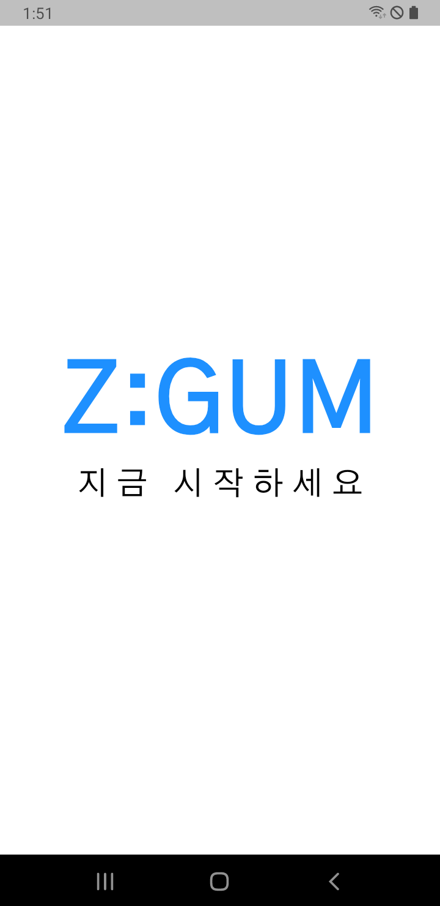
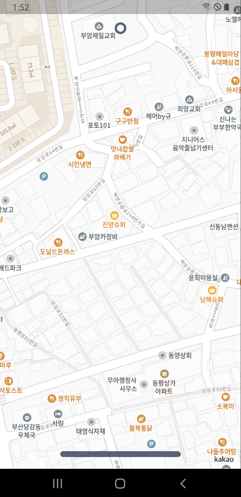
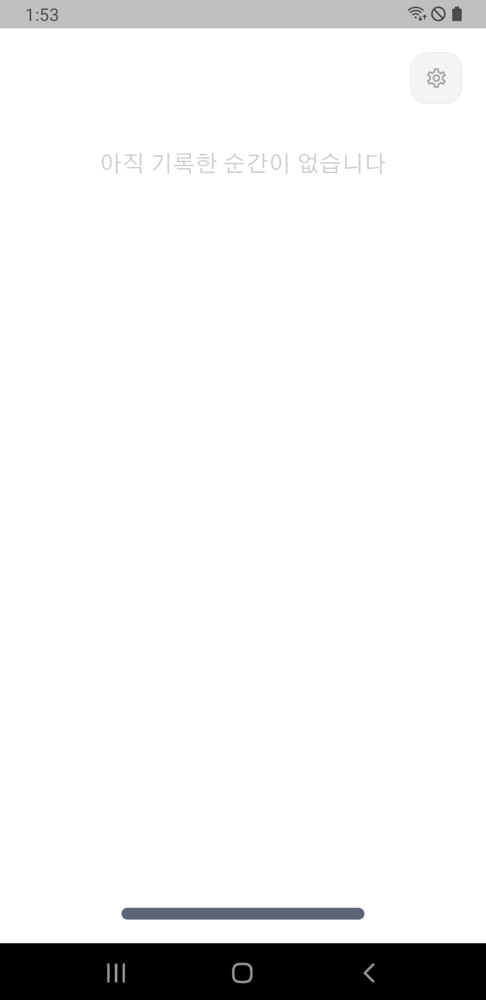
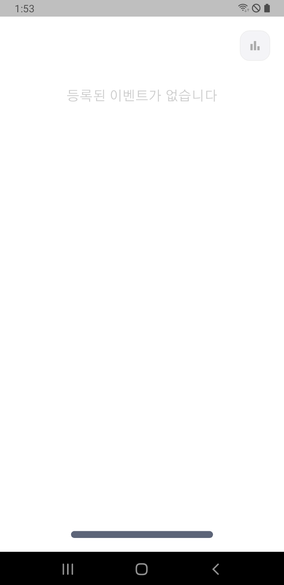

# 2026 KAMCO Startup TechBlaze — 공모 제안서
**부문**: 예비창업자·스타트업 / AI·공공데이터 활용 제품 및 서비스 개발
**마감**: 2026년 7월 9일

---

## 1. 사업명 및 한 줄 요약

**서비스명**: Z:GUM (지금)

> 파편화된 지역 문화 행사 정보를 한곳에 집약해 보여주고, 도전하는 모든 개인과 소상공인이 직접 알릴 수 있는 모바일 플랫폼

---

## 2. 문제 정의

### 공급 측 (소상공인·도전하는 개인)
- 지역 소상공인과 개인은 행사를 열어도 알릴 채널이 없다
- 버스킹·핸드메이드 공예·나눔장터 등 도전하는 청년들이 활동을 알릴 공식 창구가 없다
- SNS 홍보는 기존 팔로워 기반이라 이제 막 시작하는 사람에게 불리하다
- 별도 앱 개발 비용 없이 행사를 등록하고 노출할 수 있는 수단이 없다

### 수요 측 (개인·청소년·시민·외국인 관광객)
- 지역 문화 행사 정보가 구청 홈페이지·SNS·포스터·앱 등 여러 곳에 흩어져 있어 한눈에 보기 어렵다
- 동네에서 오늘 무슨 행사가 열리는지 실시간으로 알 수 있는 수단이 없다
- 정보가 분산되어 있어 개인이 접근하는 데 드는 시간·노력 비용이 크다
- 청소년은 지역 문화 정보 접근 경로가 없어 대형 플랫폼 콘텐츠에만 의존한다
- 외국인 관광객은 도시 방문 시 현지 축제·문화 행사 정보를 모국어로 한곳에서 확인하기 어렵다

### 공공데이터 활용 공백
- 문화체육관광부·한국관광공사·소상공인시장진흥공단이 문화·상권 데이터를 공개하고 있으나
  위치 기반으로 시민에게 실시간 전달하는 민간 앱이 존재하지 않는다

---

## 3. 솔루션: Z:GUM

### 작동 구조

```
공공 문화 행사 API (Tour API·KOPIS)  ──┐
소상공인 상가정보 API (SDSC)            ──┼──→  Z:GUM  ──→  사용자 (시민·청소년)
카카오 로컬 API (장소 검색)             ──┤         ↕
소상공인·개인 직접 등록                    ──┘   흔적 (방문 기록·사진·메모)
```

1. **개인정보 보호 우선 설계**: 회원가입 없이 설치 즉시 사용 가능 — 식별 정보 외 어떠한 개인정보도 수집하지 않으며, 개인정보 유출 위험을 구조적으로 차단
2. **미성년자 보호**: 성인 인증 기반 콘텐츠 분리 — 성인 콘텐츠는 인증된 사용자에게만 노출되며 미성년자에게 구조적으로 차단
3. **공공데이터 수집**: 한국관광공사 TourAPI·KOPIS 공연예술통합전산망·소상공인시장진흥공단 상가정보에서 지역 행사 자동 수집 및 지도 표시
4. **민간 등록 레이어**: 소상공인·개인 예술가가 앱에서 직접 행사 등록 → 공공 행사 지도 위에 함께 표시
5. **위치 기반 탐색**: 사용자 현재 위치 기준 반경 내 행사 실시간 표시 (GPS 4단계 폴백 알고리즘)
6. **흔적 기록**: 방문 인증·사진 저장·메모 → 사용자 문화 생활 아카이빙
7. **이음(소셜)**: 근거리 친구 탐색·관계 형성·위치 공유 (최소 100m 이내 자동 감지)

### 개발 현황 (실현가능성 근거)

Flutter 기반 Android/iOS 크로스플랫폼 앱 **MVP 완성 (총 147개 Dart 파일)**

| 기능 | 상태 |
|------|------|
| 카카오맵 기반 실시간 행사 마커 표시 | 완료 |
| GPS 위치 추적 (4단계 폴백 알고리즘) | 완료 |
| 한국관광공사 TourAPI 연동 | 완료 |
| KOPIS 공연예술 데이터 연동 | 완료 |
| 소상공인 상가정보(SDSC) API 연동 | 완료 |
| 카카오 로컬 API 장소 검색 | 완료 |
| 사용자 행사 등록·관리 기능 | 완료 |
| 행사 카테고리·시간 필터 | 완료 |
| 방문 기록(흔적)·사진 저장 | 완료 |
| 생체 인증 (지문·얼굴·PIN) | 완료 |
| 로컬 알림 (행사 알람·친구 알림) | 완료 |
| 다국어 지원 (한·영·일·중) | 완료 |
| 이음(친구) 시스템 설계·모델 | 완료 |
| Firebase 백엔드 연동 | 개발 예정 |
| 결제 연동 (Naver Pay·Kakao Pay) | 개발 예정 |

---

## 4. 앱 화면 (실제 작동 스크린샷)

> MVP 완성 상태 — 실제 기기에서 촬영한 화면입니다.

| 시작 화면 | 지도 화면 |
|:---:|:---:|
|  |  |
| 앱 실행 시 브랜딩 화면 | 카카오맵 기반 실시간 행사 지도 |

| 방문 기록 화면 | 행사 등록 화면 |
|:---:|:---:|
|  |  |
| 방문 기록(흔적) 보관함 | 소상공인·개인 행사 직접 등록 |

---

## 5. 공공데이터 활용 내역

| 데이터 출처 | 활용 방법 | 연동 현황 |
|---|---|---|
| 한국관광공사 TourAPI (축제·공연·행사) | 지역 문화 행사 자동 수집·지도 표시 | 완료 |
| 문화체육관광부 KOPIS | 공연예술 정보 (공연 목록·시설 좌표) 수집 | 완료 |
| 소상공인시장진흥공단 SDSC | 지역 상가 정보 조회·지도 연동 | 완료 |
| 카카오 로컬 API | 행사 장소 검색·지오코딩·지도 표시 | 완료 |
| 지자체 공개 데이터 | 각 구청별로 개별 공개된 무료 문화 행사 데이터를 통합 수집 | 추가 예정 |

### 공공데이터 처리 흐름 — "수집에서 시민 손까지"

```
[1단계] 수집
한국관광공사 TourAPI + KOPIS + SDSC 소상공인 상가정보
      ↓
[2단계] 위치 필터링
사용자 현재 GPS 위치 기준 반경 내 행사만 추출
(오늘·내일·이번 주 시간대 필터 포함)
      ↓
[3단계] 민간 데이터 합산
소상공인·개인이 직접 등록한 행사와 통합
→ 공공 행사 + 민간 행사를 하나의 지도에 표시
      ↓
[4단계] 사용자 전달
지도 핀 탭 → 행사 상세 (장소·시간·내용) 확인
방문 후 체크인 → 흔적(사진·메모) 기록 저장
```

**공공데이터가 만드는 실질적 가치**
- 시민이 구청 홈페이지 여러 곳을 돌아다니지 않아도 현재 위치 기준으로 오늘 갈 수 있는 행사를 한 번에 확인
- 개인 예술가의 팝업 전시가 국가 축제와 같은 지도에 표시 → 공공데이터가 소규모 민간 문화 활동을 끌어올리는 레버리지 역할
- KOPIS 공연 데이터와 소상공인 상가정보가 결합되어 지역 문화 생태계 전체가 한 지도 위에 통합
- 외국인 관광객이 공공 축제·문화 행사 데이터를 모국어로 한곳에서 확인 → 공공데이터가 관광 접근성까지 높이는 구조

### AI 활용 현황 및 계획
- **현재 (개발 단계)**: 코딩 경험 없는 창업자가 생성형 AI를 활용한 바이브코딩(Vibe Coding)으로 147개 파일 규모의 앱을 직접 개발 — AI가 기술 창업의 진입 장벽을 허문 실증 사례
- **1단계 (런칭 후)**: 사용자 위치·방문 기록 기반 행사 추천 (콘텐츠 기반 필터링)
- **2단계**: 시간대·날씨·요일 패턴 기반 개인화 추천 강화
- **3단계**: 공공 행사 텍스트 자동 요약 및 청소년 친화 언어 변환 (LLM 적용)
- **4단계 (문화 취약지역 분석)**: 행사 등록·방문 흔적 데이터가 들어오지 않는 지역을 AI가 자동으로 문화 취약지역으로 판별 → 공공데이터와 교차 분석해 지역별 문화 공백 지도 생성 → 지자체에 정책 수립 근거 리포트로 제공

---

## 6. Z:GUM ZONE — 지역 축제 디지털 전환 모델

### 개념

지역 축제 개최 구역 전체를 **Z:GUM ZONE**으로 설정한다.
축제장에 입장한 방문객의 스마트폰에 참가 소상공인·예술가 부스 지도가 자동 표시된다.

```
[축제 주최 측]
  축제 구역 등록 → Z:GUM ZONE 생성 (지오펜싱)
        ↓
[참가 소상공인·예술가]
  부스 정보 등록 → ZONE 내 지도에 자동 노출
        ↓
[방문객 (시민·청소년)]
  축제장 입장 → 앱에서 "이 축제 참가 업체 32곳" 확인
  부스 방문 → 체크인(흔적) 기록
```

### 제공 가치

| 대상 | Z:GUM ZONE이 주는 것 |
|---|---|
| 축제 주최 측 | 참가 업체 디지털 안내도 자동 생성, 방문객 행동 데이터 제공 |
| 참가 소상공인 | 별도 비용 없이 방문객 스마트폰에 노출, 체크인 수 집계 |
| 참가 예술가 | 작품·공연 정보 등록 → 현장 방문객에게 실시간 안내 |
| 방문객 (청소년 포함) | 축제 전체 지도 한눈에 파악, 방문 기록 자동 저장 |

### 공공데이터 연결 지점

- 한국관광공사 TourAPI·KOPIS·지자체 축제 데이터에서 축제 일정·장소 자동 수집
- 해당 축제가 열리는 날·장소와 Z:GUM ZONE을 자동 매핑
- 공공 축제 데이터가 실제 참가 소상공인 정보와 결합되는 구조

### B2B 수익 모델

- 축제 주최 측 (지자체·민간 축제 운영사)과 Z:GUM ZONE 서비스 계약
- 참가 업체 수 기준 정액 또는 부스당 소액 수수료
- 축제 종료 후 방문 통계·체크인 리포트 제공 (데이터 부가가치)

---

## 7. 타겟 및 사회적 가치

### 타겟 3그룹

**소상공인·도전하는 개인**
- 카페·갤러리·공방·식당 등 공간 보유 사업자
- 행사 등록으로 신규 방문객 유입, 마케팅 비용 절감
- 첫 6개월 무료 등록 정책으로 진입 장벽 제거

**개인 예술가**
- 작가·음악인·퍼포머 등 고정 공간 없는 독립 예술가
- 팝업 전시·공연 행사 무료 등록 가능
- 공공 행사와 동일 지도에 나란히 노출 → 대형 플랫폼 없이도 발견 가능

**청소년·청년**
- 지역 문화 행사를 실시간으로 발견하는 첫 번째 수단
- 방문 인증 기록으로 문화 생활 포트폴리오 형성
- 공공 무료 행사 중심 → 경제적 부담 없는 문화 접근

**외국인 관광객**
- 도시 방문 시 주변 축제·문화 행사를 한눈에 확인
- 한·영·일·중 4개 언어 지원 → 언어 장벽 없이 즉시 사용 가능
- 별도 가입 없이 설치 즉시 현지 문화 정보 접근

### 사회적 가치

- **지역 경제 활성화**: 소상공인·예술가의 홍보 비용 절감, 신규 방문객 연결
- **문화 소비 균형**: 대형 플랫폼 중심에서 지역·소규모 공간으로 분산
- **청소년 문화 접근성**: 분산된 정보를 하나의 앱에서 실시간으로 제공
- **청소년 안전 보호**: 성인 인증 기반 콘텐츠 분리로 미성년자에게 성인 콘텐츠가 노출되지 않는 구조 적용
- **공공데이터 활용 모델**: 공개된 공공 행사 데이터가 시민에게 실제로 닿는 구조 제시

---

## 8. 기술 구조

### 아키텍처 개요

```
[공공 API 계층]
TourAPI / KOPIS / SDSC / Kakao Local API
        ↓
[Repository 계층] (인터페이스 + Mock/API 구현체 분리)
        ↓
[Provider 계층] (Riverpod 상태 관리)
        ↓
[UI 계층] (Flutter — Android/iOS 동시 빌드)
        ↓
[로컬 저장] SharedPreferences (클라우드 전환 예정)
```

### 핵심 기술 구현

- **GPS 4단계 폴백**: GPS 정밀 → 이전 세션 위치 → Wi-Fi/기지국 → 기본값(서울시청)
- **행사 시간 판정**: 0~60분(긴박 펄스), 30분~3시간(추천 표시), 30분 미만(표시 제외)
- **어댑터 패턴**: 공공 API 응답을 통합 AppModel로 변환 (API 교체 시 어댑터만 수정)
- **생체 인증 게이트**: 앱 진입 시 지문·얼굴·PIN 인증 (local_auth)
- **다국어**: 한·영·일·중 4개 언어 (intl + ARB 파일)

---

## 9. 비즈니스 모델

| 수익원 | 방식 | 시점 |
|---|---|---|
| 행사 등록 구독 | 소상공인·개인 월정액 행사 등록·노출 | 런칭 직후 |
| 프리미엄 노출 | 지도 상단 고정, 우선 노출 광고 | 성장 후 |
| 지자체 B2B | 지역 문화재단·축제 운영 기관 공식 파트너십 | 2단계 |
| 데이터 인사이트 | 지역 문화 소비 패턴 리포트 판매 | 장기 |

---

## 10. 시장성

- 국내 문화 행사 시장: 연간 약 4조 원 규모 (문체부 2024)
- 공공 문화시설 연간 이용객: 1억 4천만 명 이상
- 국내 소상공인 수: 약 580만 명 (2025 통계청) — 대부분 디지털 마케팅 수단 부재
- **동일 앱 없음**: 위치 기반 실시간 문화 행사를 소상공인 등록과 공공데이터가 동시에 표시되는 앱은 국내외 존재하지 않음

---

## 11. 실행 계획

| 단계 | 기간 | 내용 |
|---|---|---|
| 디자인 완성 | 2026년 7월 | UI 디자인 완성, 앱스토어 자료 준비 |
| 서버 연동 | 2026년 8~9월 | Firebase 백엔드, 실서비스 결제 연동 |
| 부산 파일럿 | 2026년 9~10월 | 부산 지역 소상공인·개인 사용자 50곳 확보 |
| 스토어 출시 | 2026년 10월 | 앱스토어·플레이스토어 정식 출시 |
| 전국 확장 | 2027년 1분기 | 서울·경기 확장, 지자체 B2B 접촉 시작 |

---

## 12. 창업자 소개

- **소재지**: 부산
- **배경**: 지역 문화 생태계의 정보 단절 문제를 직접 경험한 40대 예비창업자
- **개발 역량**: 코딩 경험 없이 생성형 AI를 활용한 바이브코딩(Vibe Coding) 방식으로 Flutter 크로스플랫폼 앱 MVP 독학 개발 완료 (147개 Dart 파일, 공공 API 3종 연동)
- **AI 활용 증명**: 이 프로젝트 자체가 "AI가 기술 창업의 진입 장벽을 낮춘다"는 것을 창업자 본인이 직접 증명하는 사례
- **지역 특성**: 부산은 국제영화제·불꽃축제 등 지역 축제 규모가 크고 독립 예술가 생태계가 활성화되어 있어 파일럿 최적지

---

## 13. 심사 기준 대응 요약

| 심사 기준 | Z:GUM |
|---|---|
| **공공데이터·AI 활용성** | TourAPI·KOPIS·SDSC 3종 연동 완료 / AI 추천 단계적 도입 계획 |
| **사업성·성장가능성** | 행사 등록 구독 수익 + 지자체 B2B 확장 경로 |
| **실현가능성** | Flutter MVP 완성 (147개 파일), 3종 공공 API 이미 연동된 실제 작동 앱 |
| **창의성·시장파급력** | 동일 앱 국내외 없음 / 소상공인·예술가·청소년 동시 연결 |

---

*작성일: 2026년 6월 15일*
